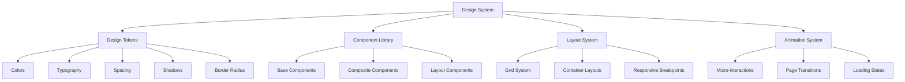

# Design Document

## Overview

The design enhancement will transform the OneTech UAE website into a modern, professional, and visually compelling platform that reflects the company's expertise in IT services. The design will leverage the existing React/Vite architecture with Tailwind CSS, Framer Motion, and GSAP to create a cohesive design system that enhances user experience while maintaining optimal performance.

The enhancement focuses on creating a premium brand experience through improved visual hierarchy, consistent design patterns, smooth animations, and responsive layouts that work seamlessly across all devices.

## Architecture

### Design System Architecture



### Technology Integration

- **Tailwind CSS**: Enhanced with custom design tokens and utility classes
- **Framer Motion**: Page transitions, scroll animations, and micro-interactions
- **GSAP**: Complex animations and timeline-based effects
- **Radix UI**: Accessible component primitives with custom styling
- **React Router**: Enhanced with smooth page transitions

## Components and Interfaces

### Enhanced Design System Components

#### 1. Typography System

```typescript
interface TypographyScale {
  display: {
    xl: string; // 72px - Hero headlines
    lg: string; // 60px - Section headlines
    md: string; // 48px - Page titles
    sm: string; // 36px - Subsection titles
  };
  heading: {
    xl: string; // 30px - Large headings
    lg: string; // 24px - Medium headings
    md: string; // 20px - Small headings
    sm: string; // 18px - Card titles
  };
  body: {
    xl: string; // 20px - Large body text
    lg: string; // 18px - Default body text
    md: string; // 16px - Small body text
    sm: string; // 14px - Caption text
    xs: string; // 12px - Fine print
  };
}
```

#### 2. Color System

```typescript
interface ColorPalette {
  primary: {
    50: string; // Lightest tint
    100: string;
    200: string;
    300: string;
    400: string;
    500: string; // Base primary color
    600: string;
    700: string;
    800: string;
    900: string; // Darkest shade
    950: string;
  };
  secondary: ColorScale;
  accent: ColorScale;
  neutral: ColorScale;
  semantic: {
    success: ColorScale;
    warning: ColorScale;
    error: ColorScale;
    info: ColorScale;
  };
}
```

#### 3. Enhanced Button Component

```typescript
interface ButtonProps {
  variant: "primary" | "secondary" | "outline" | "ghost" | "link";
  size: "xs" | "sm" | "md" | "lg" | "xl";
  loading?: boolean;
  icon?: ReactNode;
  iconPosition?: "left" | "right";
  fullWidth?: boolean;
  animation?: "scale" | "slide" | "fade";
}
```

#### 4. Card Component System

```typescript
interface CardProps {
  variant: "elevated" | "outlined" | "filled" | "glass";
  padding: "none" | "sm" | "md" | "lg" | "xl";
  hover?: boolean;
  animation?: "lift" | "glow" | "scale";
  gradient?: boolean;
}
```

### Layout Components

#### 1. Enhanced Navigation

- Sticky navigation with backdrop blur
- Smooth scroll indicators
- Mobile-first responsive design
- Animated menu transitions
- Service category mega-menus

#### 2. Hero Section Redesign

- Full-viewport hero with parallax effects
- Animated text reveals
- Interactive background elements
- Clear call-to-action hierarchy
- Video background support

#### 3. Service Cards Enhancement

- Consistent card layouts with hover effects
- Icon integration with animations
- Progressive disclosure of information
- Category-based filtering
- Grid and list view options

## Data Models

### Theme Configuration

```typescript
interface ThemeConfig {
  colors: ColorPalette;
  typography: TypographyScale;
  spacing: SpacingScale;
  shadows: ShadowScale;
  borderRadius: BorderRadiusScale;
  animations: AnimationConfig;
  breakpoints: BreakpointConfig;
}
```

### Animation Configuration

```typescript
interface AnimationConfig {
  durations: {
    fast: number; // 150ms
    normal: number; // 300ms
    slow: number; // 500ms
  };
  easings: {
    easeInOut: string;
    easeOut: string;
    easeIn: string;
    bounce: string;
  };
  transitions: {
    page: MotionProps;
    modal: MotionProps;
    card: MotionProps;
  };
}
```

### Component State Management

```typescript
interface ComponentState {
  loading: boolean;
  error: string | null;
  theme: "light" | "dark";
  animations: boolean;
  reducedMotion: boolean;
}
```

## Error Handling

### Design System Error Boundaries

- Graceful fallbacks for component failures
- Error state designs for loading failures
- Network error handling with retry mechanisms
- Form validation error states
- 404 and error page designs

### Performance Error Handling

- Image loading fallbacks
- Animation performance monitoring
- Lazy loading error states
- Bundle loading error recovery

## Testing Strategy

### Visual Regression Testing

- Component screenshot testing
- Cross-browser compatibility testing
- Responsive design testing
- Animation testing

### Accessibility Testing

- Color contrast validation
- Keyboard navigation testing
- Screen reader compatibility
- Focus management testing

### Performance Testing

- Animation performance monitoring
- Bundle size optimization
- Core Web Vitals tracking
- Loading performance testing

### User Experience Testing

- Usability testing protocols
- A/B testing framework
- User journey testing
- Conversion optimization testing

## Implementation Approach

### Phase 1: Design System Foundation

- Establish design tokens and CSS custom properties
- Create base component library
- Implement typography and color systems
- Set up animation utilities

### Phase 2: Component Enhancement

- Enhance existing UI components
- Create new composite components
- Implement consistent styling patterns
- Add animation and interaction states

### Phase 3: Layout and Navigation

- Redesign navigation system
- Enhance page layouts
- Implement responsive grid system
- Add page transition animations

### Phase 4: Content and Visual Polish

- Enhance service pages
- Improve content presentation
- Add visual elements and imagery
- Implement micro-interactions

### Phase 5: Performance and Optimization

- Optimize animations and transitions
- Implement lazy loading
- Bundle optimization
- Performance monitoring setup
